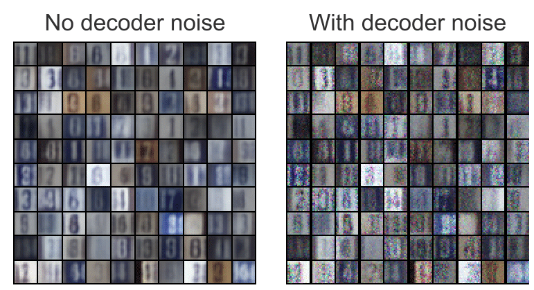

# CS294-158-SP19

My Pytorch implementation of Berkeley Deep Unsupervised Learning from Spring 2019  
Only notable results have been included

## Homework 1 Results

### Exercise 1.2
### MADE network on 2d data:

### PixelCNN results

## Homework 2 Results
### Original Data, note colors

### Autoregressive Flow results

### Autoregressive Flow Latent Space

### Simple Real NVP Results

### Simple Real NVP Latent and Generated Samples

### Simple Real NVP Latent Colored

## Homework 3 Results
### Model Training Curves.  
Note that scalar variance data set 1 KL is almost 0

### Results on Data set 1
Note how mean of vector variance model is centered at 0

### Latent Space of Data set 1 Models
Top: Data colored.
Note, how the latent of vector variance is completely scrambled, no data is stored. Reconstructions are similar. This shows latent is not used. This is due to the data being able to be completely modeled by the decoder with no help of the latent.

### Results on Data set 1

### Latent Space of Data set 1 Models
This time both models behave the same due to the multivariate diagonal covariance gaussian being insufficient to model the data alone.

### IWAE Training

### IWAE Results

### IWAE Latent space

### SVHN Training Curve

### SVHN Training Curve

### SVHN Results

### SVHN Interpolations

### WGAN Training Curves

### WGAN Results

